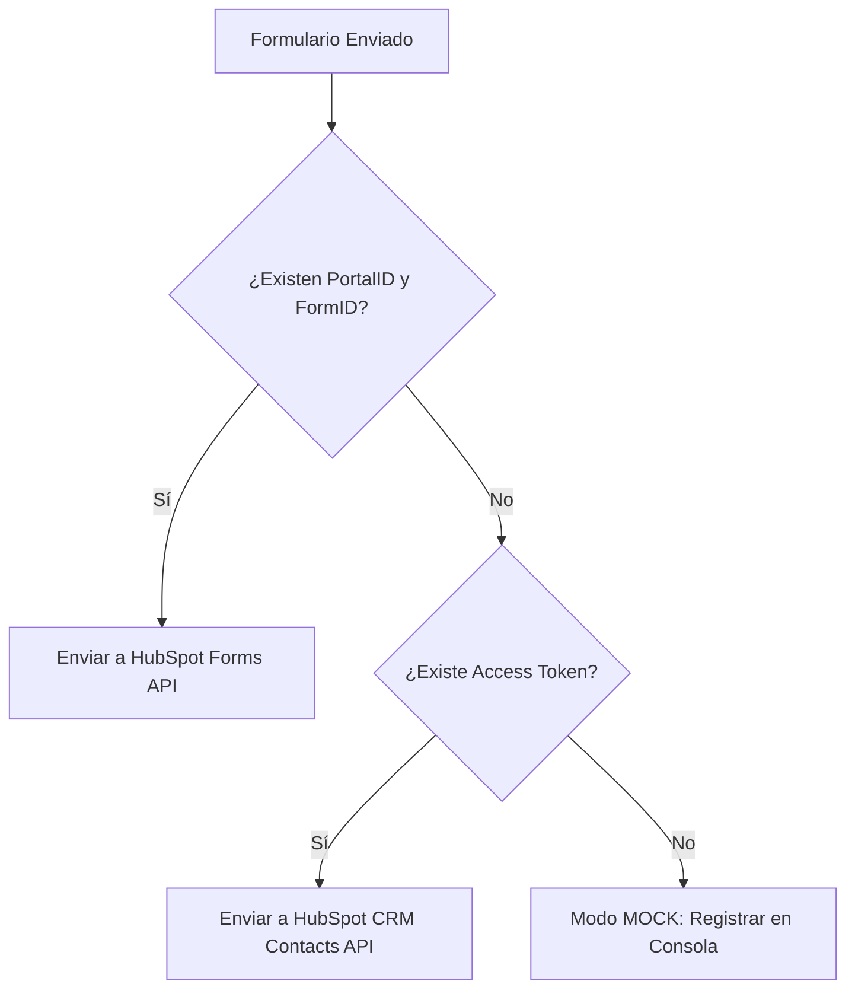

# Decisiones de Arquitectura — Vorello Web

Este documento registra las convenciones y decisiones de diseño técnico tomadas durante el rework de estructura del proyecto. Cualquier nuevo desarrollo o refactorización debe alinearse con estos principios para mantener la consistencia y solidez de la base de código.

---

## 1. Organización de Páginas Complejas (App Router)

Para evitar la saturación de los directorios globales como `components/` o `lib/`, se implementa el patrón de **carpetas privadas** dentro de los grupos de rutas y la raíz de `app/`.

```txt
app/
  _components/          # Secciones exclusivas de la Landing Page principal (Hero, Services, etc.)
  (pages)/
    start/
      _components/      # Componentes exclusivos de esta página (ej. Stepper, StartForm, etc.)
      _lib/             # Lógica, custom hooks, tipos y esquemas específicos de la página
      page.tsx          # Punto de entrada limpio (Server/Client stitching)
```

### Reglas:
* **Páginas limpias:** El archivo `page.tsx` no debe contener marcado inline de formularios o layouts grandes. Actúa como el orquestador que importa el Navbar, Footer y el cascarón/formulario de la página.
* **Componentes locales:** Las piezas visuales que no se reutilizan en otras partes de la web pertenecen a `_components` (tanto en la raíz de `app/` para la landing como en páginas secundarias).
* **Centralización de lógica:** El estado y la validación de los formularios se extraen a un custom hook local (ej. `_lib/use-start-form.ts`).

---

## 2. Componentes de Formulario Base y de Layout

* **Componentes Atómicos (`components/ui/`):** Los inputs y elementos comunes se extraen aquí para homogeneizar el estilo de la marca Vorello (grises oscuros, bordes violetas/azules sutiles y textos monospaciados tipo consola).
  * `Input`, `TextArea`, `Button`, `Badge`, `Logo`.
  * `CardSelector`: Un componente modular para reemplazar selectores HTML convencionales por tarjetas oscuras interactivas de Aceternity/Vorello.
  * `CountrySelect`: Menú desplegable personalizado de países con ordenamiento geográfico prioritario de mercados objetivos.
  * `PhoneInput`: Selector internacional avanzado (integra `react-international-phone`).
* **Elementos de Estructura y Widgets (`components/layout/`):** Elementos que definen el esqueleto global de la página, envoltorios de diseño responsivo o widgets globales.
  * `Navbar`, `Footer`, `SmoothScroll`.
  * `Container`, `Section`, `SectionHeading` (Estructura base de las secciones).
  * `WhatsAppFloat`: Widget flotante de contacto directo con animación de GSAP sincronizada.
  * `TechScaleDivider`: Separador decorativo técnico para transiciones estéticas de sección.

---

## 3. Prevención de Hydration Errors en Componentes de Terceros

Las librerías de cliente que dependen de objetos globales del navegador (como `window`, `navigator` o geolocalización por huso horario) causan discrepancias de hidratación si Next.js intenta pre-renderizarlas en el servidor.

### Convención:
* Cargar estos componentes de forma dinámica mediante `next/dynamic` deshabilitando el renderizado en servidor (`ssr: false`).
* Proveer un componente de esqueleto (`loading`) de tamaño equivalente para evitar el *Layout Shift* (CLS) durante la carga en cliente.

*Ejemplo aplicado en `StartForm.tsx`:*
```typescript
const PhoneInput = dynamic(() => import("@/components/ui/PhoneInput"), {
  ssr: false,
  loading: () => <PhoneInputSkeleton />
});
```

---

## 4. Estrategia de Persistencia de Borradores (Draft Saving)

Para mejorar la experiencia de usuario (UX), los formularios largos (`contact` y `start`) guardan automáticamente los datos ingresados en el almacenamiento local.

* **Debouncing:** El auto-guardado en `localStorage` se procesa bajo un retardo de `500ms` tras la última tecla presionada para evitar saturar el disco.
* **Limpieza de sesión:** El borrador se remueve del almacenamiento local únicamente cuando la API retorna una respuesta exitosa (`success: true`).
* **Saneamiento:** El proceso está envuelto en bloques `try/catch` para evitar fallos catastróficos en navegadores con almacenamiento lleno o navegación privada.

---

## 5. Integración Multi-Capa con HubSpot (API Routes)

Las APIs en `app/api/` deben funcionar sin depender estrictamente de llaves privadas en entornos de desarrollo local, permitiendo que cualquier programador levante el proyecto de forma inmediata.



* **HubSpot Forms API:** Es el método principal para integrarse con las automatizaciones de marketing (workflow, atribución de página de origen).
* **HubSpot CRM Contacts API:** Funciona como respaldo utilizando un Token de Acceso Privado.
* **Modo Mock:** Si no hay credenciales configuradas en las variables de entorno, la ruta retorna `success: true` e imprime los datos del lead formateados en la consola del servidor.

---

## 6. Sincronización de Animaciones con Accesibilidad (A11y)

Todas las animaciones de la interfaz (GSAP timelines, transiciones de paso de Stepper, coordenadas del puntero para efectos de brillo, y el retraso de entrada del widget flotante de WhatsApp) deben alinearse con las directrices del sistema operativo del usuario.

* **Soporte de Reduced Motion:** Antes de instanciar un Timeline de GSAP o un efecto, se evalúa la consulta de medios:
  ```typescript
  const prefersReducedMotion = window.matchMedia("(prefers-reduced-motion: reduce)").matches;
  ```
  Si es afirmativa, se deshabilita la transición física (`x`, `y`, `scale`) y se fuerza la opacidad instantánea o la inicialización estática del elemento.
* **Coordenadas y Performance:** Los efectos de brillo basados en el movimiento del puntero en el home y la sección `Process` se ejecutan mediante eventos en tiempo de ejecución sincronizados con `requestAnimationFrame`. Se apagan en dispositivos con `hover: none` (táctiles) para preservar rendimiento de CPU/batería.
